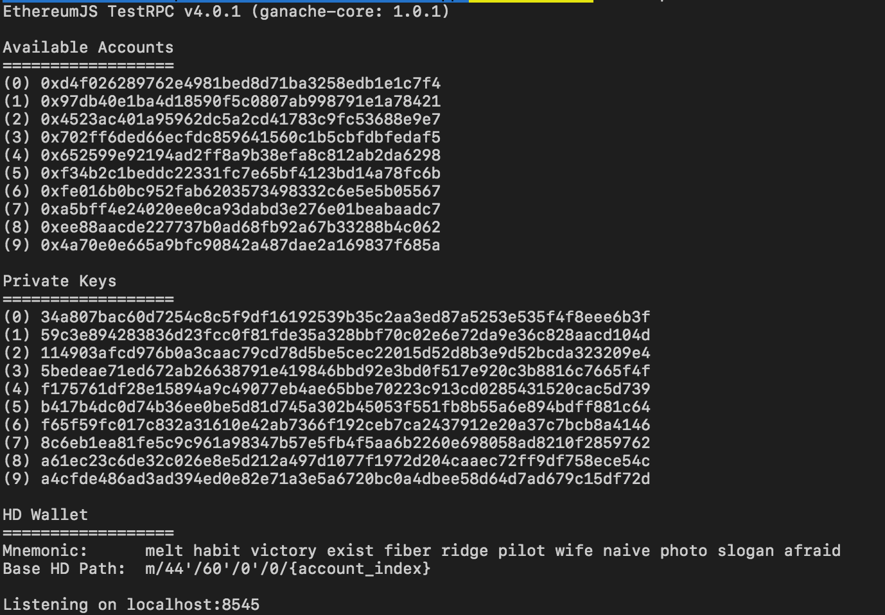
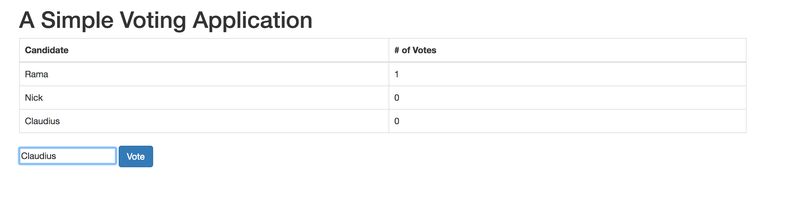
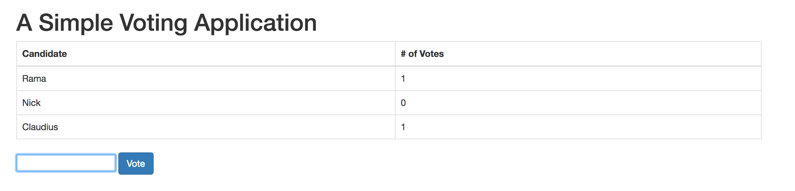

# Tutorial: Building a simple Voting DApp manually

### ***If you like this project, give it a [](https://github.com/user1m/votingdapptut).  If you find issues, [create an issue](https://github.com/user1m/votingdapptut/issues).***


#### Estimated Time: 20mins

This tutorial is adapted from [this tutorial](https://medium.com/@mvmurthy/full-stack-hello-world-voting-ethereum-dapp-tutorial-part-1-40d2d0d807c2) by [Mahesh Murthy](https://medium.com/@mvmurthy)

#### The goal is to give you a basic understanding of what frameworks like [Truffle](http://truffleframework.com/) are doing under the hood to deploy contracts and let you interact with them.

* To be clear, truffle is not covered in this tutorial. Check out [Mahesh's other tutorial](https://medium.com/@mvmurthy/full-stack-hello-world-voting-ethereum-dapp-tutorial-part-2-30b3d335aa1f).

### In this tutorial you'll briefly get familiar with the following technologies:

* [web3JS](https://github.com/ethereum/web3.js/) - Javascript API that allows you to interact with the Ethereum blockchain
* [solc](https://github.com/ethereum/solc-js) - JS bindings for the Solidity compiler
* [ganache-cli](https://github.com/trufflesuite/ganache-cli) - An in memory ethereum blockchain simulator

**NOTE:** All of the code for this tutorial is included in this repo.

**NOTE: I highly recommend copying the code found in this tutorial line by line in order to understand exactly what each line of code does. That's why I've split the code the way I did, in more modular chunks.**

## Prerequisites
* [NodeJS](https://nodejs.org/en/download/)
* `npm` - installed with node
* [VSCode](https://code.visualstudio.com/)

## Table of Contents:

* [Writing a contract](#writing-a-contract)
* [Run Ganache-cli](#run-ganache-cli)
* [Deploying a contract locally](#deploying-a-contract-locally)
* [Building the UI](#building-the-ui)
* [Connecting it all together](#connecting-it-all-together)


## Writing a contract
* Create a project directory
* `npm init` a `package.json`
* Install some npm dependencies
* Create a file called `Voting.sol` and open it in [your favorite text editor](https://code.visualstudio.com/)

```sh
> mkdir votingdapp
> cd votingdapp
> npm init
> npm install -g ganache-cli http-server
> npm install solc web3@0.20.6 --save
> touch Voting.sol
```
* **Note:** Make sure to install `web3 version 0.20.6` since at the time of this writing `npm install web3` is defaulted to a beta version that isn't as stable.

* Copy the code below, in order, into `Voting.sol`. Comments inline:

```js
pragma solidity ^0.4.11;
// specifies what version of compiler this code will be compiled with
```

```js
contract Voting {
  /* the mapping field below is equivalent to an associative array or hash.
  */

  mapping (bytes32 => uint8) public votesReceived;

  /* Solidity doesn't let you pass in an array of strings in the constructor (yet).
  We will use an array of bytes32 instead to store the list of candidates
  */

  bytes32[] public candidateList;

  /* This is the constructor which will be called once and only once - when you
  deploy the contract to the blockchain. When we deploy the contract,
  we will pass an array of candidates who will be contesting in the election
  */
  constructor(bytes32[] candidateNames) public {
    candidateList = candidateNames;
  }
```

```js
  // This function returns the total votes a candidate has received so far
  function totalVotesFor(bytes32 candidate) public view returns (uint8) {
    assert(validCandidate(candidate) == true);
    return votesReceived[candidate];
  }

  // This function increments the vote count for the specified candidate. This
  // is equivalent to casting a vote
  function voteForCandidate(bytes32 candidate) public {
    assert(validCandidate(candidate) == true);
    votesReceived[candidate] += 1;
  }

  function validCandidate(bytes32 candidate) public view returns (bool) {
    for(uint i = 0; i < candidateList.length; i++) {
      if (candidateList[i] == candidate) {
        return true;
      }
    }
    return false;
  }
}
```


## Run Ganache-cli

* In the terminal run:

```sh
> ganache-cli
```

* This will start an in memory blockchain simulator for us to play with.
* Ganache-cli initializes with 10 wallets and their private keys
* Do not close this terminal session. Keep it running in the background. This is our blockchain.



* **Note**: ganache-cli is running on `localhost:8545`


## Deploying a contract locally


* Create a file called `deployContract.js`
* Open `deployContract.js` in your text editor
* Copy the code below, in order. Comments inline:

```js
var solc = require("solc"); // import the solidity compiler
var Web3 = require("web3"); // import web3
var fs = require("fs");  //import the file system module
var web3 = new Web3(new Web3.providers.HttpProvider("http://localhost:8545")); //initialize the web3 object to listen on the port ganache-cli is running on - so we can communicate with the blockchain
```

```js
//query all the accounts in the blockchain
console.log("\n------------ LOGGING ACCOUNTS -------------\n");
console.log(web3.eth.accounts);
```

```js
//compile the contract - load the code from Voting.sol in to a string variable and compile it.
var code = fs.readFileSync("Voting.sol").toString();
var compiledCode = solc.compile(code);

console.log("\n------------ LOGGING COMPILED CODE -------------\n");
console.log(compiledCode);
```

```js
//grab the bytecode from Voting.sol compiled - This is the code which will be deployed to the blockchain.
var byteCode = compiledCode.contracts[":Voting"].bytecode;
console.log("\n------------ LOGGING BYTECODE -------------\n");
console.log(byteCode);
```

```js
//grab the contract interface, called the Application Binary Interface (ABI), which tells the user what methods are available in the contract.
var abi = compiledCode.contracts[":Voting"].interface;
console.log("\n------------ LOGGING Application Binary Interface (ABI) -------------\n");
console.log(abi);
```

```js
//parse the abi string into a JS object
var abiDefinition = JSON.parse(abi);

//deploy the contract:

//1. You first create a contract object which is used to deploy and initiate contracts in the blockchain.
var VotingContract = web3.eth.contract(abiDefinition);

var contractInstance;
```

```js
//2. VotingContract.new below deploys the contract to the blockchain.

//The first parameter is contract constructor parameters. We pass in our 3 candidates (an array of bytes32 as defined in our contract constructor
//Note: if our contract tool more parameters, they be listed in order following the first parameter

//The next parameter is the info needed to actually deploy the contract:
//data: This is the compiled bytecode that we deploy to the blockchain
//from: The blockchain has to keep track of who deployed the contract. In this case, we are just picking the first account. In the live blockchain, you can not just use any account. You have to own that account and unlock it before transacting. You are asked for a passphrase while creating an account and that is what you use to prove your ownership of that account. Ganache-cli by default unlocks all the 10 accounts for convenience.
//gas: It costs money to interact with the blockchain. This money goes to miners who do all the work to include your code in the blockchain. You have to specify how much money you are willing to pay to get your code included in the blockchain and you do that by setting the value of ‘gas’. The ether balance in your ‘from’ account will be used to buy gas. The price of gas is set by the network. The amount of gas it takes to execute a transaction or deployment is calculated by the operations in the contract / function being executed.

//The final parameter is a callback function. After the contract is deployed this function will be called with either an error or our contract instance

var deployedContract = VotingContract.new(
    ["Rama", "Nick", "Claudius"],
    {
        data: byteCode,
        from: web3.eth.accounts[0],
        gas: 4700000
    },
    function(e, contract) {
        if (!e) {
            if (!contract.address) {
                console.log("\n------------ Contract waiting to be mined -------------\n");
                console.log("Contract transaction send: TransactionHash: " + contract.transactionHash + " waiting to be mined...\n");
            } else {
```

```js
                console.log("Contract mined! Address: " + contract.address);
                console.log("\n------------ LOGGING Deployed Contract  -------------\n");
                //NOTE: When you have to interact with your contract, you will need this deployed address and abi definition (More below)
                console.log(contract);
```

```js
                console.log("\n------------ LOGGING Contract Address -------------\n");
                console.log(contract.address);
```

```js
                //get the instance of the contract at this address
                contractInstance = VotingContract.at(contract.address);
```

```js
                //execute contract functions on the blockchain
                console.log("\n------------ LOGGING Executing contract calls -------------\n");
                console.log("Votes for Rama before: ");
                //totalVotesFor() is a function in our contract
                console.log(contractInstance.totalVotesFor.call("Rama").valueOf());

                //execute a transaction. The transaction id (output) is the proof that this transaction occurred and you can refer back to this at any time in the future. This transaction is immutable.
                console.log(contractInstance.voteForCandidate("Rama", {from: web3.eth.accounts[0]}));

                //votes for Rama should go up by 1
                console.log("Votes for Rama after: ");
                console.log(contractInstance.totalVotesFor.call("Rama").valueOf());
```

```js
                //write the contract address and abi to file for client side JS to use to interact with contract
                fs.writeFile("./contract.json",
                    JSON.stringify(
                    {
                        address: contract.address,
                        abi: JSON.stringify(abiDefinition, null, 2)
                    },
                    null,
                    2),
                    "utf-8",
                    function(err) {
                            if (err) {
                                console.log("ERROR: ");
                                console.log(err);
                            } else {
                                console.log(`The file ./contract.json was saved!`);
                            }
                    }
                );
            }
        } else {
            console.log(e);
        }
    }
);
```


* Update scripts in`package.json` to below

```json
"scripts": {
    "start": "node deployContract.js && http-server .",
    "test": "echo \"Error: no test specified\" && exit 1"
  },
```

## Building the UI

* Create `index.html` and copy the code below

```html
<!DOCTYPE html>
<html>

<head>
  <title>Voting DApp</title>
  <link href='https://fonts.googleapis.com/css?family=Open+Sans:400,700' rel='stylesheet' type='text/css'>
  <link href='https://maxcdn.bootstrapcdn.com/bootstrap/3.3.7/css/bootstrap.min.css' rel='stylesheet' type='text/css'>
</head>

<body class="container">
  <h1>A Simple Voting Application</h1>
  <div class="table-responsive">
    <table class="table table-bordered">
      <thead>
        <tr>
          <th>Candidate</th>
          <th># of Votes</th>
        </tr>
      </thead>
      <tbody>
        <tr>
          <td>Rama</td>
          <td id="candidate-1"></td>
        </tr>
        <tr>
          <td>Nick</td>
          <td id="candidate-2"></td>
        </tr>
        <tr>
          <td>Claudius</td>
          <td id="candidate-3"></td>
        </tr>
      </tbody>
    </table>
  </div>
  <input type="text" id="candidate" />
  <a href="#" onclick="voteForCandidate()" class="btn btn-primary">Vote</a>
</body>

<script src="https://cdn.rawgit.com/ethereum/web3.js/develop/dist/web3.js"></script>
<script src="https://code.jquery.com/jquery-3.2.1.min.js" integrity="sha256-hwg4gsxgFZhOsEEamdOYGBf13FyQuiTwlAQgxVSNgt4="
  crossorigin="anonymous"></script>
<script src="./index.js"></script>

</html>
```

* **Note**: The first script tag is a link to web3 (gives us access to web3 on the client browser), then jquery, then our index.js (coming up next)

## Connecting it all together

* Create an `index.js` file
* Copy the code below, in order, into it (comments inline):

```js
//after the script tags are loaded (web3 & jquery) run this function
window.onload = function() {
```

```js
    //initialize web3
    var web3 = new Web3(new Web3.providers.HttpProvider("http://localhost:8545"));
    var contractInstance;
```

```js
    //load the json file we wrote to earlier
    $.getJSON("./contract.json", function(contract) {

        //get the instance of our contract using the (1) address and (2) abi as discussed earlier
        //we will always need these 2 to interact with a deployed contract instance
        contractInstance = web3.eth.contract(JSON.parse(contract.abi)).at(contract.address);

        //on the vote button click, execute this function on the contract.
        //from: sign the transaction by using the first account
        window.voteForCandidate = function() {
            candidateName = $("#candidate").val();
            contractInstance.voteForCandidate(candidateName, {from: web3.eth.accounts[0]},
                function() {
                    let div_id = candidates[candidateName];
                    $("#" + div_id).html(contractInstance.totalVotesFor.call(candidateName).toString());
                }
            );
        };

        //after we have an instance of the contract update the initial candidate votes
        //recall that during deploying the contract we updated votes for Rama to 1
        for (var i = 0; i < candidateNames.length; i++) {
            let name = candidateNames[i];
            let val = contractInstance.totalVotesFor.call(name).toString();
            $("#" + candidates[name]).html(val);
        }
    });
```

```js
    var candidates = {
        Rama: "candidate-1",
        Nick: "candidate-2",
        Claudius: "candidate-3"
    };

    var candidateNames = Object.keys(candidates);

    //initialize candidate votes to 0 until we have an instance of the contract instance
    $(document).ready(function(event) {
        for (var i = 0; i < candidateNames.length; i++) {
            let name = candidateNames[i];
            $("#" + candidates[name]).html(0);
        }
    });
};

```

## Run it

* **Note**: Make sure `ganache-cli` is still running
* Run `npm start` in the terminal - This will deploy the contract to `ganache-cli` and start a web-server
	* You should notice some console logs being outputted to the terminal
	* Additionally, checkout the `contract.json` file created as you deployed the contract
* Visit the url indicated by `http-server` (likely `http://localhost:8080`)




### Congratulations!
You've built an application that can interact with the blockchain! You saw how to write a smart contract, deploy said contract, and call contract functions. That's all we're going to cover in this but I hope this gave you a better sense for building DApps.

## Authors

* **Claudius Mbemba** - [User1m](https://github.com/user1m)


## Acknowledgments

* [Mahesh Murthy](https://medium.com/@mvmurthy)

